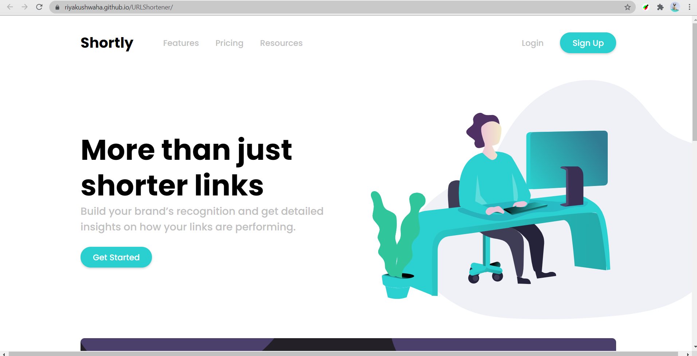
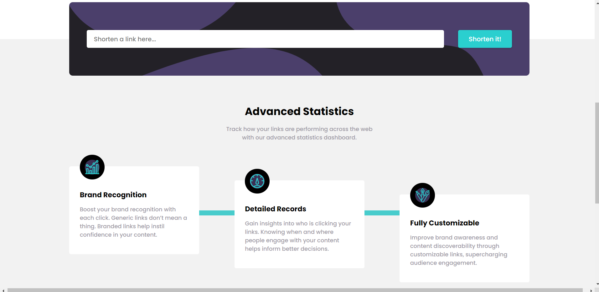

### The challenge

Users should be able to:

- ✅  Integrate with the rel.ink API to build a fully-functional URL shortener
- ✅  View the optimal layout for the site depending on their device's screen size
- ✅  Shorten any valid URL
- ✅  See a list of their shortened links, even after refreshing the browser
- ✅  Copy the shortened link to their clipboard in a single click
- ✅  Receive an error message when the `form` is submitted if: The `input` field is empty

### Screenshot

### Built with

- Semantic HTML5 markup
- CSS custom properties
- Flexbox
- CSS Grid
- Desktop-first workflow